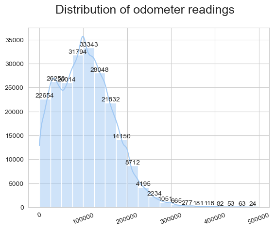
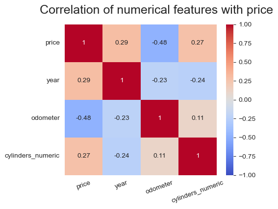
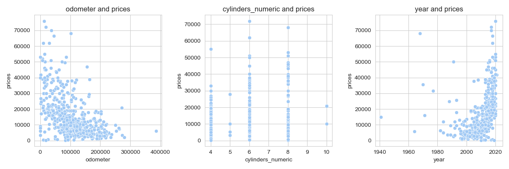
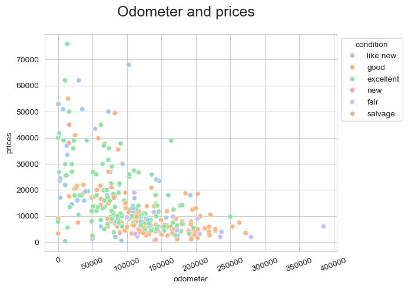
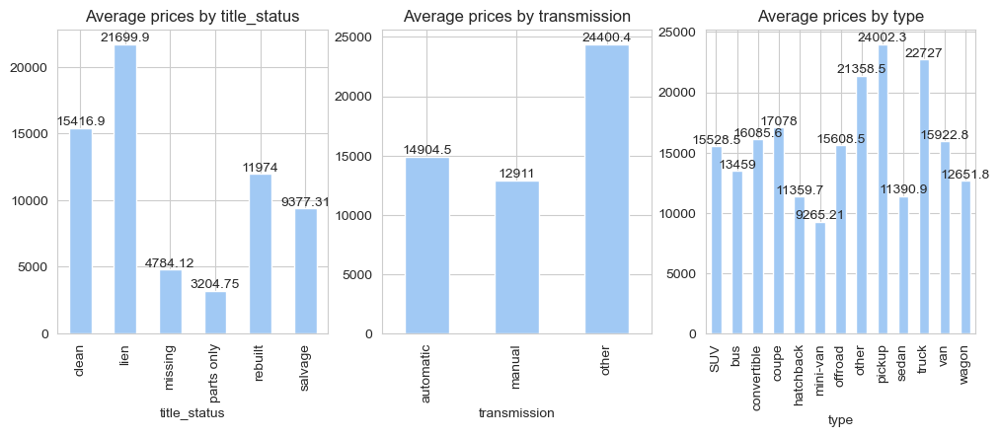
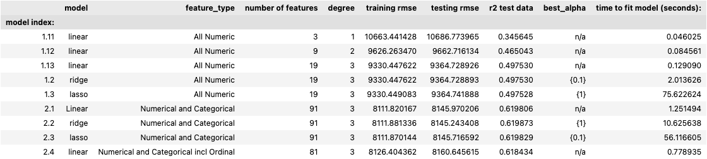
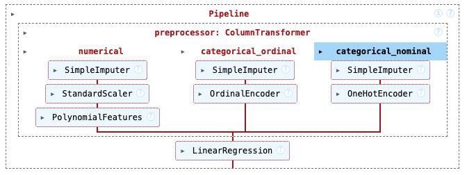

# Used Car Price Analysis

## Overview

This project aims to analyze a dataset of used cars to identify the key factors that influence their prices. The original dataset contained 3M vehicles, however we are provided with information on 426K cars, including various attributes such as condition, odometer reading, year, and more. The goal is to develop a predictive model to help a used car dealership understand what consumers value in a used car.

## Business Understanding

From a business perspective, the task is to identify key attributes that drive the price of used car prices. This involves leveraging the provided vehicles data set, conducting exploratory data analysis, preparing data, and using machine learning to identify features that the customers would value in used cars. This informmation may be used by dealerships to make business decisions on their inventory.

## Summary of Findings and Recommendations

### Predicting used car price

The chosen machine learning model makes predictions on the price of a car given on the following features: 
1. odometer reading, year, number of cylinders
2. title status, manufacturer, condition, fuel type, vehicle type

As an example, our chosen model predicts the price of 3 vehicles (all 2005 yr, 6 cyl, clean title, 100k miles, manual, sedan, gas) as follows:
1. Toyota: 6,389.37
2. Audi: 7,869.89
3. Ford: 5,453.41

We find that the top features that have the biggest `positive` impact on the price of the car as follows:

1. Manufacturer: `Ferrari, Tesla, Ashton Martin, Porsche`
2. Fuel Type: `Diesel`
3. Title Status: `Lien`
4. Type: `Pickup`
5. Condition: `like new`

Similarity the top features that have the most `negative` impact on the price of the car as follows:

1. Manufacturer: `Fiat, Harley, Mitsubishi, Kia, Nissan, Chrysler`
2. Fuel Type: `Electric`
3. Type: `Bus, hatchback`
4. Title: `parts only`

There are many other features that have an impact on the price between these two extremes. These are detailed in the notebook.

This model scored at 61% and require further improvement before it may be used by dealership to determine features of most importance.

### Next steps recommendation

A good model should have a score of 80% or more. Ways in which the model may be improved are to revisit the strategy for missing data such as condition, cylinders, drive, size and other columns. These features were inferred using most frequently occuring (mode) method. Perhaps a classifier such KNeighborsClassifier may be used to impute these values

Instead of computing missing values, another strategy may be to drop all rows with missing values. This would shrink the data to 15% of it's original size i.e. about 60k used vehicle records. Building a model with such a data data set may provide a better model, assuming the significanly reduced data set can provide a good representation of the overall data. This requires further analysis.

Data such as region, state, and model were not included in the evaluation due to the limitation of the compute system. These features can be explored further with a more powerful compute system.

Additional model optimization may be accomplished by reviewing the outlier conditions, scaling methods and further adjusting the hyper parameters of the model.

---

## DETAILS

### Initial data analysis

Initial data analysis provided the following assessment:
1. Vehicles with `lower odometer` readings, and `newer year models` command higher values. As the odometer readings increase the condition of the vehicles determine the value of the vehicle. Vehicles in `new, like new conditions` command higher prices
2. More `recent year vehicles sell for more` than than older vehicles
3. Vehicles with higher number of cylinders command higher prices. On average vehicles with `6, 8 cylinders sell for 15k and 17.5k` respectively, compared to 4 cylinder that sell for ~11k
3. Vehicles in `new and like new conditions sell on average for ~27k and 19k` respectively. Salvaged vehicles on the other hand sell on average for 3.7k
4. Vehicles with `parts only titles sell for 3.2k` on average

### Data Preparation Tasks

The following steps were taken to treat missing and duplicate data, and data that were not included in the model due to the limitatations of the compute system.

1. Removing IDs, VINs - since these are text columns and would not have an impact on the price
2. Removing categorical columns with a large number of unique values such as state(51), region (404), model(29549). While some models of vehicles in some states may drive price, including all these values, will make the models evaluated below too complicated to run on laptops.
3. Removing columns with more than 50% missing data (size of vehicle - 70% missing values)
4. Dropping duplicate rows (approx 182K rows were duplicate VIN numbers)
5. Converting data types (cylinder from string to numeric)
6. Addressed outliers with price and odometer. For the purposes of this analysis all vehicles price < 100K and odometer <500k are included

### Exploratory data analysis (EDA)

Some of the EDA done on this data set is presented. Additional charts are available in the plots sub folder and within the notebook

1. Most cars that were evaluated had odomoter readings between of less than 100k miles 

    

2. Correlation of price with numerical features such as odometer, year and cylinders

- **Price and Odometer**: There is a moderate negative correlation (-0.41) between price and odometer reading. This indicates that as the odometer reading increases, the price of the vehicle tends to decrease. This is expected as cars with higher mileage are generally less expensive.

- **Price and Years**: There is a positive correlation between price and the number of cylinders (0.29). This suggests that more recent vehicles tend to be priced higher. This 

    

3. Comparing prices with year, odometer and cylinders. We can see that are odometer values increase, prices fall and newer cars command higher prices

    

4. The condition of the vehicle helps improve the price, given a higher odometer reading

    

5. Comparing average vehicle price by title, transmission and type, we can observe that vehicles with lien title & pick ups have higher prices on avg

    

### Model evaluation

The table below summarizes the evaluation metrics of different models that were run on the vehicles dataset

 

 We observed the following with these models

* LinearRegression model, degree 1 for numerical features scored the lowest at 34%. A degree 2 model helped improve the score to 46% 
* Ridge, Lasso models for numerical features with degree 3 scored at 49%. GridSearchCV was used to find the best alpha values, indicated in the table
* LinearRegression model was further improved with additional of categorical variables. This helped improved the score to 61% (model index 2.1 above)
* Ridge, Lasso for numerical and categorical with OHE returned the same score as LinearRegression at 61%
* Finally a LinearRegression model with Numercial, Categorical (both OHE and ordinal) was created. The score did not improve with this model and remained at 61%

`Note`: on Lasso for numerical and categorical columns (model index 2.3). The model fit was taking a long time and providing convergence warnings, so I changed the default parameters for GridSearchCV: change cross validation to 2, # and n_jobs to -1 (to use all processors)

`Model Recommendation`: Considering there is no improvement using Lasso or Ridge regression and time cost of regularization (specially Lasso) models are high, the recommendation is to use the `LinearRegression model with both numerical and categorical variables`. 

This is model index 2.4 in the above evaluation table, described here:

### Files

- `prompt_A.ipynb`: The Jupyter Notebook containing the analysis and modeling
- `data/vehicles.csv`: The dataset used for the analysis
- `images/`: Directory containing images used in the notebook
- `plots/`: Directory containing plots generated by the Jupyter notebook and referred in the readme file
- `readme.md`: This readme file

### Requirements

- Python 3.x
- pandas
- numpy
- matplotlib
- seaborn
- scikit-learn

### How to Run

1. Clone the repository
2. Install the required packages
3. Open the Jupyter Notebook and run the cells sequentially
